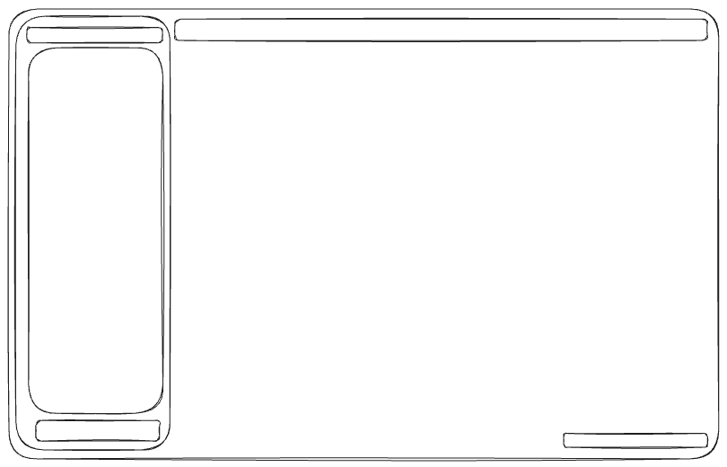

## **Application Design**

This draft outlines the initial design for the application interface. The goal is to deliver a user-centric experience that is highly functional, visually elegant, and intuitive to navigate.

### **Interface Layout**

1. **Sidebar (Left Panel)**  
   - **Top Toolbar:**  
     Provides quick access to file and folder creation functionalities, inspired by the simplicity and utility of Visual Studio Code (VSCode).  
   - **Directory Explorer:**  
     A scrollable, nested view of files and folders, enabling users to efficiently browse their workspace.  
   - **Settings Bar (Bottom):**  
     Offers quick access to settings and preferences, similar to Obsidian’s design philosophy.  
   - **Collapsible Feature:**  
     The entire sidebar can be collapsed or expanded to maximize the available workspace.

2. **Top Tab Bar**  
   - Displays all currently opened files, including Markdown and Excalidraw documents.  
   - Facilitates easy switching between documents, ensuring a streamlined workflow.

3. **Footer Bar (Bottom Right)**  
   - Displays the document’s word count in real-time.  
   - Provides toggles for enabling/disabling spell check and other quick-access settings.

4. **Main Editor Area**  
   - The largest portion of the screen is dedicated to the text editor, offering a distraction-free environment for content creation.

---

### **Design Philosophy**
The design takes cues from well-established tools like VSCode and Obsidian, combining their strengths to create a seamless, professional user interface tailored to productivity.

